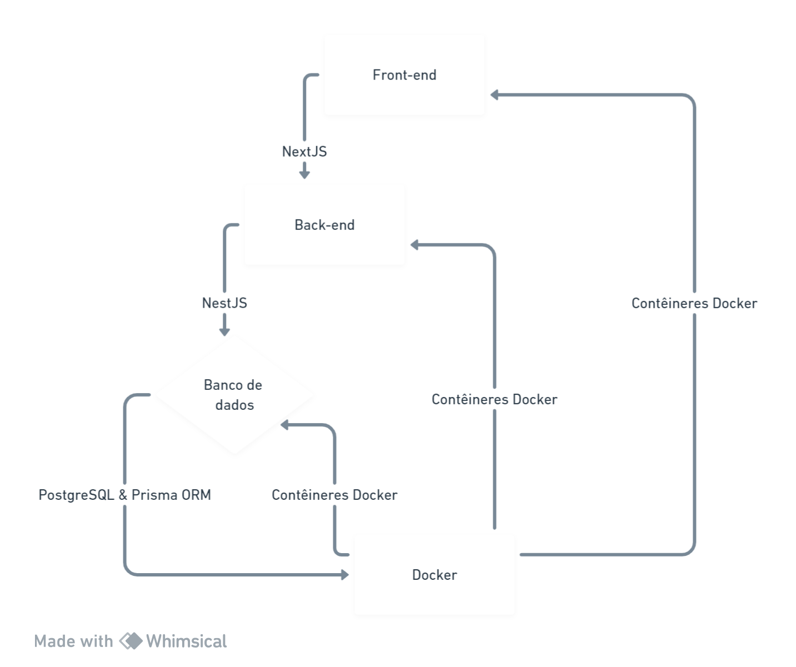

**1. Introdução**

Propósito do Documento

Este documento tem como objetivo fornecer uma visão abrangente do sistema "Power Habits", um aplicativo dedicado a ajudar os usuários a estabelecer, rastrear e manter hábitos saudáveis diariamente. Destina-se a ser um recurso para os stakeholders do projeto, incluindo a equipe de desenvolvimento, designers, e qualquer parte interessada que deseje entender as funcionalidades e os objetivos do aplicativo.

Descrição do Produto

"Power Habits" é uma ferramenta digital projetada para motivar os usuários a construir uma rotina de hábitos positivos, oferecendo um acompanhamento intuitivo e interativo. Através de uma interface amigável e recursos motivacionais, os usuários podem adicionar novos hábitos, definir lembretes, e visualizar seu progresso em tempo real.

Objetivos do Produto

Os principais objetivos do "Power Habits" são:

- Facilitar a criação de hábitos com a adição e edição simplificada de atividades.
- Oferecer rastreamento diário que permite aos usuários acompanhar seus hábitos com marcadores de conclusão.
- Proporcionar feedback visual do progresso através de estatísticas e indicadores de desempenho.
- Ajudar na manutenção dos hábitos com lembretes e notificações.

Público-Alvo

O aplicativo é destinado a qualquer pessoa interessada em melhorar seu estilo de vida através do desenvolvimento de hábitos consistentes. Ele é especialmente benéfico para usuários que buscam uma maneira estruturada e motivacional de fazer mudanças duradouras em suas rotinas diárias.

Escopo do Documento

Este documento detalhará as funcionalidades do aplicativo, requisitos do sistema, arquitetura do projeto, e instruções para uso e manutenção do sistema. As seções seguintes incluirão descrições detalhadas dos recursos, interfaces de usuário, e interações do sistema.

**2. Visão Geral do Sistema**

Arquitetura do Aplicativo

O aplicativo "Power Habits" é construído sobre uma arquitetura robusta que permite flexibilidade e escalabilidade. Ele é dividido em duas partes principais: o frontend, responsável pela interação do usuário com o aplicativo, e o backend, que gerencia a lógica de negócios, operações de banco de dados e integrações de serviços.

- **Frontend**: Desenvolvido com uma combinação de tecnologias modernas como React para uma interface reativa e adaptável em diferentes dispositivos. O design é focado na experiência do usuário, com uma interface limpa e intuitiva.
- **Backend**: Implementado usando o framework NestJS para uma estrutura de aplicativo eficiente e escalável, integrado com o Prisma ORM para gestão de banco de dados PostgreSQL.

Fluxo de Dados

Os dados fluem do frontend para o backend através de APIs RESTful, que processam as solicitações dos usuários e comunicam com o banco de dados para armazenar e recuperar informações. A autenticação dos usuários é gerenciada por tokens JWT, garantindo a segurança das transações de dados.

Banco de Dados

O banco de dados PostgreSQL é estruturado para armazenar dados relacionados a usuários, hábitos, e acompanhamento diário. As tabelas são otimizadas para consultas rápidas e eficientes, com índices apropriados para acelerar a busca de dados.

Segurança

O sistema implementa práticas de segurança de ponta, incluindo criptografia de senhas, proteção contra CSRF e XSS, e verificações rigorosas de autenticação e autorização.

Integração com Serviços Externos

"Power Habits" pode se integrar com serviços de terceiros para funcionalidades como envio de notificações push, análises de dados de uso, e backups automáticos do banco de dados.

Suporte a Dispositivos

A aplicação é responsiva e compatível com uma ampla gama de dispositivos, incluindo smartphones, tablets e desktops. O layout se adapta dinamicamente para oferecer a melhor experiência em qualquer tamanho de tela.

Requisitos de Sistema

Para garantir o funcionamento ideal do aplicativo, os seguintes requisitos de sistema são recomendados para o servidor de hospedagem e para os dispositivos dos usuários:

- Servidor com recursos escaláveis para suportar o crescimento do número de usuários.
- Conexão estável com a internet para o acesso contínuo ao banco de dados e serviços de backend.
- Navegadores modernos com suporte para as últimas tecnologias web.

**3. Funcionalidades do Sistema**

Autenticação de Usuários

O sistema "Power Habits" possui um módulo de autenticação robusto que permite aos usuários criar contas pessoais e acessar o aplicativo. O processo inclui:

- **Cadastro de Usuário**: Novos usuários podem se registrar fornecendo informações básicas, como nome, e-mail e senha. A senha é criptografada para armazenamento seguro no banco de dados.
- **Login**: Os usuários registrados podem fazer login usando suas credenciais. O sistema valida as informações e, se bem-sucedido, gera um token JWT para sessões seguras.
- **Recuperação de Senha**: Em caso de esquecimento da senha, os usuários podem solicitar uma redefinição, que é gerenciada através de e-mail.

Gerenciamento de Hábitos

Os usuários podem criar e acompanhar hábitos diários com as seguintes funcionalidades:

- **Criação de Hábitos**: Os usuários podem adicionar novos hábitos, especificando nome, descrição, ícones representativos e detalhes de frequência e notificações.
- **Edição de Hábitos**: Hábitos existentes podem ser editados para atualizar qualquer uma das informações fornecidas anteriormente.
- **Deleção de Hábitos**: Usuários podem deletar hábitos que não desejam mais acompanhar.
- **Conclusão de Hábitos**: Para hábitos completados, os usuários podem marcar como concluídos, o que é refletido no progresso diário.

Rastreamento de Hábitos

O aplicativo fornece uma visão geral do progresso do usuário, incluindo:

- **Visão Diária**: Exibe os hábitos planejados para o dia atual, permitindo que os usuários acompanhem seu progresso ao longo do dia.
- **Histórico de Hábitos**: Os usuários podem visualizar o histórico de hábitos para monitorar seu desempenho ao longo do tempo.
- **Análise de Progresso**: Um dashboard resumido exibe o progresso geral do usuário, como a porcentagem de hábitos concluídos no dia atual.

Notificações

O sistema pode enviar lembretes e notificações para ajudar os usuários a manterem-se em dia com seus hábitos:

- **Lembretes**: Os usuários podem configurar lembretes para hábitos específicos, recebendo notificações no horário programado.
- **Alertas de Conclusão**: Após a conclusão de um hábito, o usuário pode receber uma notificação de sucesso, encorajando a continuidade do comportamento positivo.

Personalização

Os usuários têm a opção de personalizar seu perfil e a experiência do aplicativo:

- **Configurações de Perfil**: Os usuários podem editar informações do perfil, incluindo nome, e-mail e foto.
- **Preferências do Aplicativo**: Os usuários podem configurar preferências gerais do aplicativo, como temas, idiomas e configurações de notificação.

Suporte e Feedback

O sistema inclui uma seção de ajuda e suporte:

- **FAQs**: Uma lista de perguntas frequentes para ajudar os usuários com problemas comuns.
- **Suporte ao Usuário**: Um canal de suporte ao usuário está disponível para problemas que requerem assistência direta.
- **Feedback do Usuário**: Os usuários podem enviar feedback sobre o aplicativo, o que pode ser usado para melhorias futuras.

Essas funcionalidades foram projetadas para fornecer uma experiência de usuário envolvente e motivadora, incentivando a adoção e manutenção de hábitos saudáveis. A implementação técnica dessas funcionalidades será detalhada nas seções de arquitetura e design técnico da documentação.

**4. Arquitetura e Design Técnico**

Visão Geral da Arquitetura

O sistema "Power Habits" é construído seguindo uma arquitetura de microserviços, otimizada para escalabilidade, manutenção e desenvolvimento ágil. Cada componente do sistema é projetado para operar de forma independente, permitindo atualizações contínuas e integração com outros serviços conforme necessário.

Componentes Principais

- **Serviço de Autenticação**: Responsável pelo registro de usuários, login, e recuperação de senha. Utiliza JWT para gestão de sessões e segurança de acesso.
- **Serviço de Hábitos**: Gerencia a criação, edição, exclusão, e acompanhamento dos hábitos dos usuários. Mantém registros históricos e análises de progresso.
- **Serviço de Notificações**: Envia lembretes e alertas aos usuários com base em suas configurações de hábitos e preferências pessoais.

Tecnologias Utilizadas

- **Backend**: Desenvolvido em NestJS, proporcionando uma estrutura robusta para a construção de aplicações server-side em Node.js.
- **Banco de Dados**: PostgreSQL para armazenamento de dados relacionais, com Prisma ORM para abstração e gestão de acesso a dados.
- **Frontend**: React é utilizado para o desenvolvimento da interface do usuário, com Redux para gerenciamento de estado.
- **Autenticação**: JWT (JSON Web Tokens) para a gestão segura de sessões e autenticação de usuários.
- **Notificações**: Serviço de notificações push integrado para o envio de lembretes e alertas.
- **Infraestrutura**: Docker para containerização e Kubernetes para orquestração de contêineres, facilitando o deploy e a escalabilidade.

Estratégia de Segurança

- **Criptografia de Senhas**: Utiliza bcrypt para hash e salting de senhas, garantindo a segurança das credenciais dos usuários.
- **Proteção contra Ataques**: Implementa medidas de segurança como rate limiting, CORS, e sanitização de entrada para proteger contra ataques comuns, como SQL Injection e XSS.
- **Autenticação e Autorização**: Emprega JWT para controle de acesso, assegurando que os usuários possam acessar apenas os recursos que têm permissão.

Monitoramento e Logs

- **Monitoramento de Aplicação**: Utiliza ferramentas como Prometheus e Grafana para monitoramento em tempo real do desempenho e saúde do sistema.
- **Logs**: Configuração de logs detalhados com ELK Stack (Elasticsearch, Logstash, Kibana) para análise e diagnóstico de problemas.

CI/CD

- **Integração Contínua**: Emprega GitHub Actions para automação de testes e integração contínua, garantindo que cada commit passe por testes automatizados antes de ser integrado ao branch principal.
- **Entrega Contínua**: Utiliza Docker e Kubernetes, juntamente com Helm charts, para automação de deploy em ambientes de desenvolvimento, teste e produção.

Este design técnico fornece uma base sólida para o desenvolvimento e operação do sistema "Power Habits", garantindo performance, segurança e uma experiência de usuário excepcional.

